# terminal-screensavers

Beautiful terminal screensavers. No install required — just run:

```bash
npx terminal-screensavers
```

Or with Bun:

```bash
bunx terminal-screensavers
```

Press any key to exit.

## Screensavers

| Name | Screenshot | Description |
|---|---|---|
| `ant-colony` |  | Simulated ants leaving pheromone trails between nest and food |
| `aquarium` |  | Fish, bubbles, and seaweed in an ASCII aquarium |
| `aurora-borealis` |  | Shimmering curtains of northern lights with twinkling stars |
| `binary-rain` | 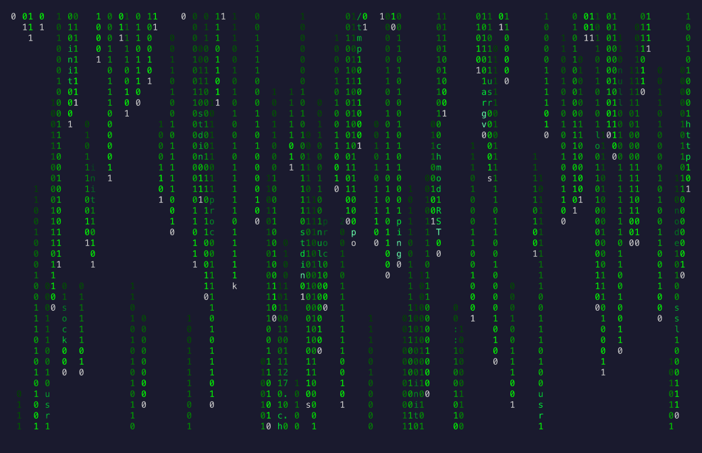 | Falling binary digits with embedded tech words and IP addresses |
| `boids` | 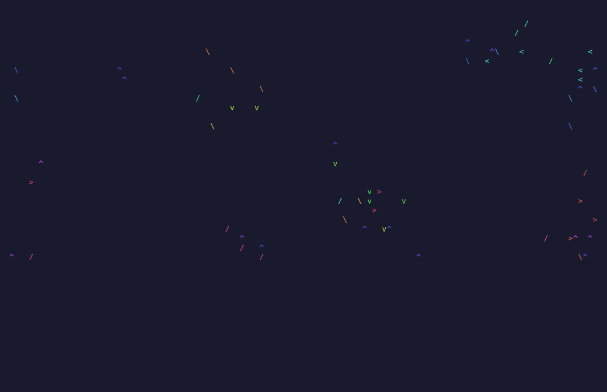 | Flocking simulation with boids that separate, align, and cohere |
| `bonsai` |  | Procedurally growing bonsai tree |
| `bouncing-logo` |  | DVD-style bouncing text block with color changes |
| `bubbles` |  | Rising bubbles that wobble and pop |
| `digital-clock` |  | Large bouncing digital clock display |
| `dna-helix` |  | Rotating DNA double helix animation |
| `fire` |  | ASCII fire rising from the bottom of the screen |
| `fireflies` | 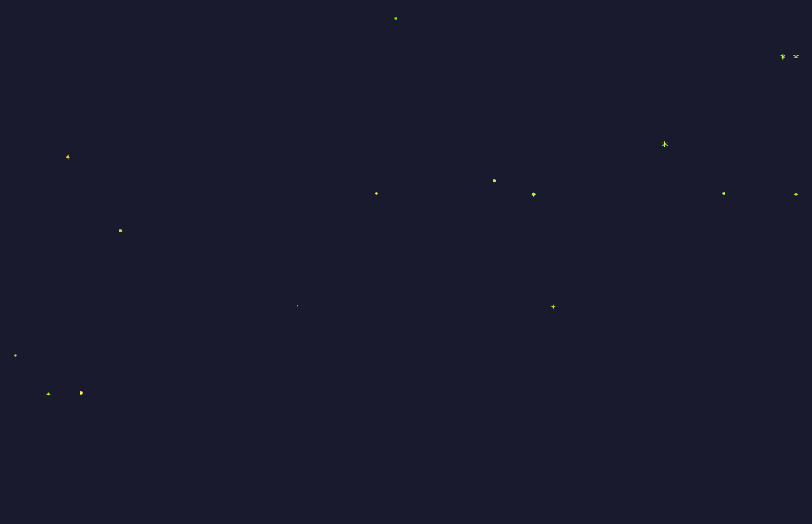 | Glowing fireflies drifting and pulsing in the dark |
| `fireworks` |  | Colorful firework rockets and explosions |
| `flying-toasters` | 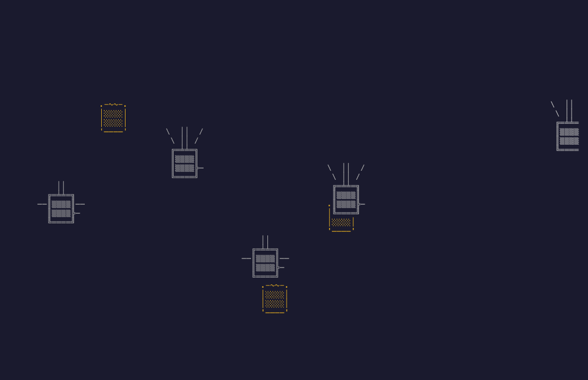 | Classic After Dark chrome toasters with flapping wings and toast |
| `game-of-life` |  | Conway's Game of Life cellular automaton |
| `gravity-wells` |  | Particles orbiting invisible gravity sources with colored trails |
| `kaleidoscope` | 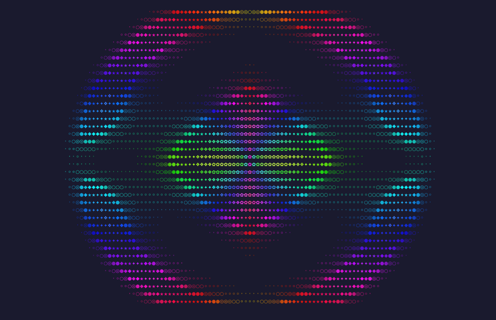 | Symmetrical patterns reflected across multiple axes with morphing colors |
| `lava-lamp` |  | Colorful metaball lava lamp blobs |
| `lightning` | 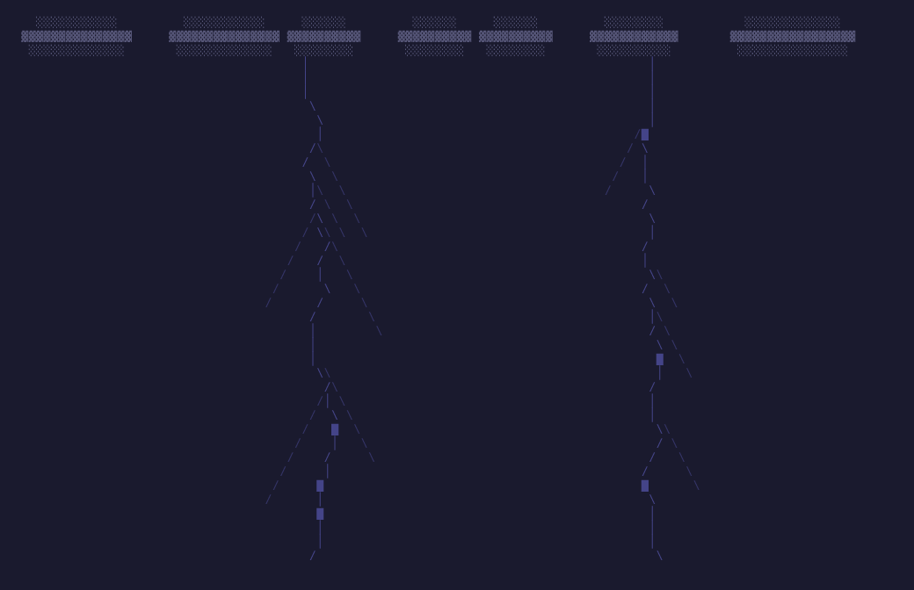 | Procedural lightning bolts striking from storm clouds with bright flashes |
| `lissajous-figures` | 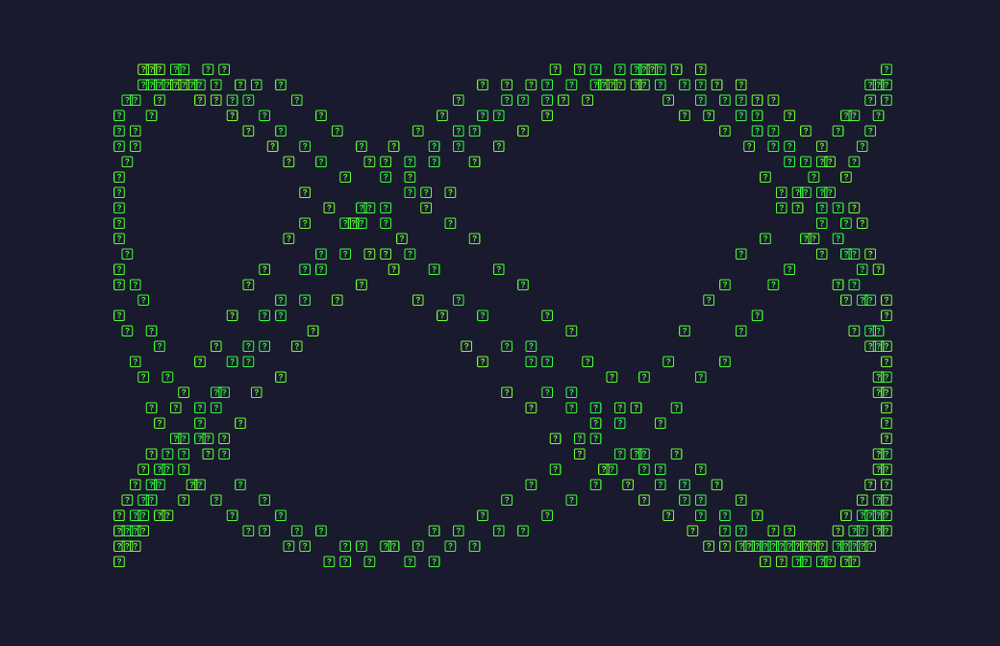 | Oscillating curves tracing Lissajous patterns with morphing frequency ratios |
| `mandelbrot-zoom` |  | Continuous zoom into the Mandelbrot set with colored ASCII |
| `matrix-rain` |  | Falling green katakana and latin characters |
| `maze` |  | Animated maze generation and solving |
| `maze-3d` | 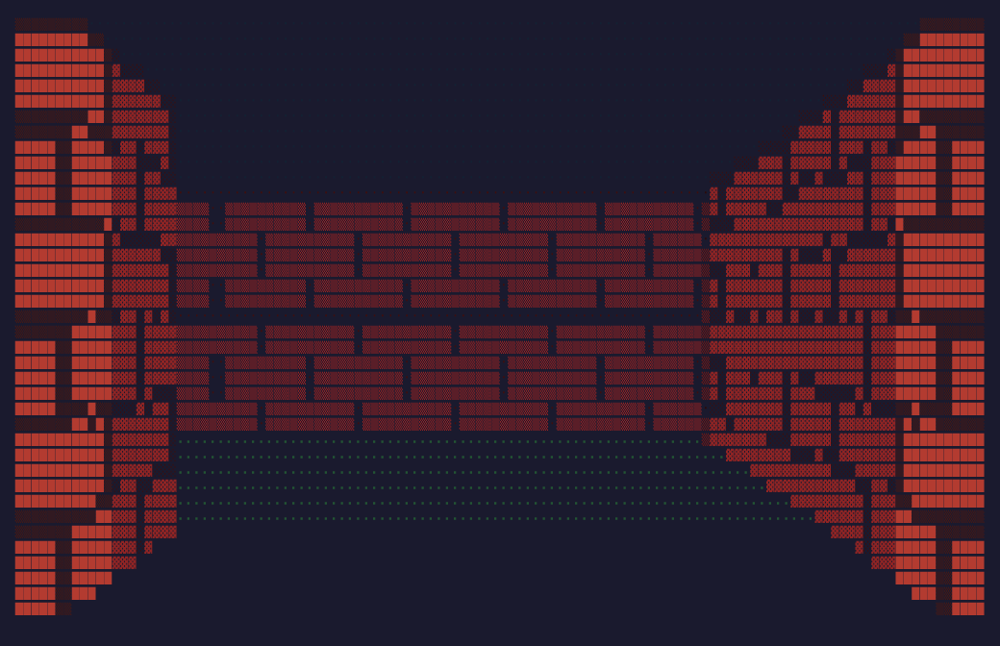 | First-person walk through an endless maze |
| `mystify` |  | Bouncing geometric shapes like the Windows classic |
| `particle-system` | 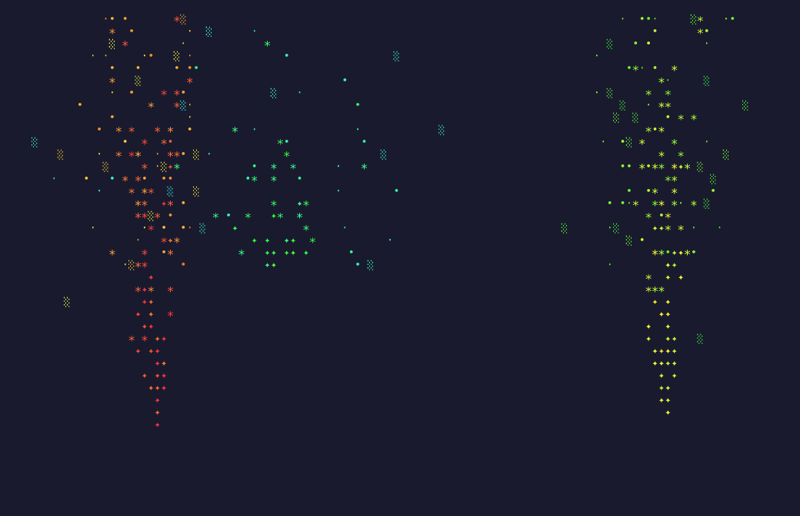 | Particle emitters with gravity, wind, and multiple modes: fountain, explosion, rain, sparks |
| `perlin-noise-field` | 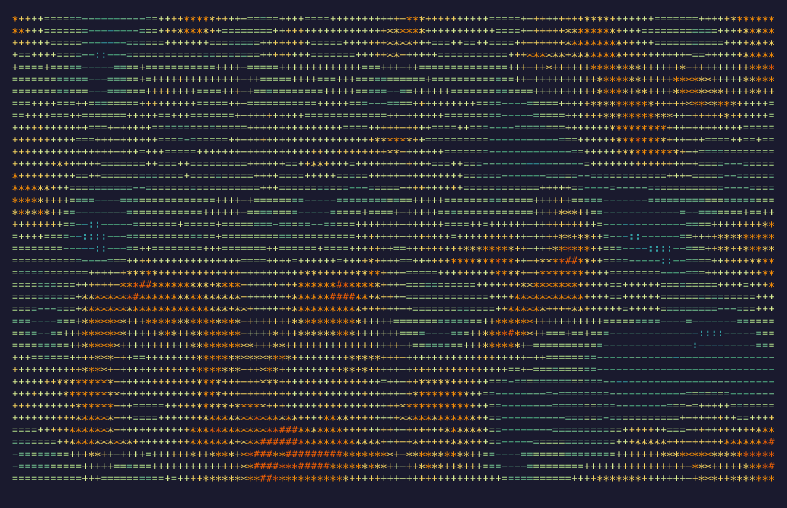 | Perlin noise visualized as characters of varying density with color gradients |
| `pipes` |  | Random pipe segments with box-drawing characters |
| `platformer` |  | Procedurally generated 2D platformer with jumping, enemies, and coins |
| `ripples` |  | Concentric ripples expanding like raindrops on a pond |
| `sand-simulation` | 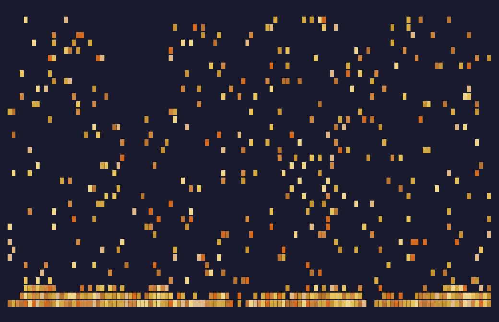 | Falling sand particles that pile up and cascade with layered colors |
| `smoke` | 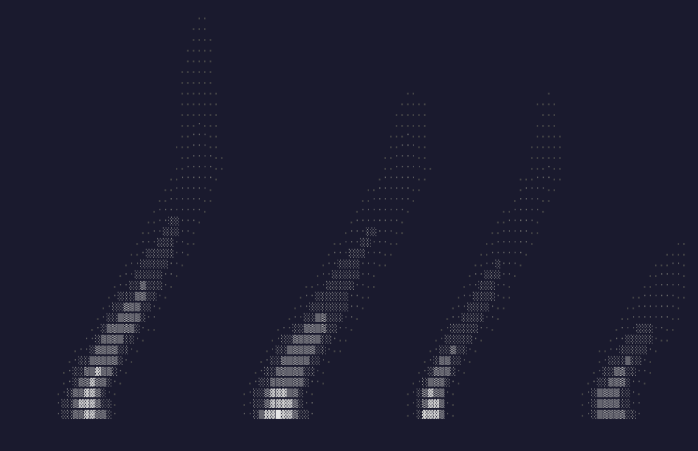 | Wispy smoke rising and dissipating with varying character density |
| `source-code-scroll` | 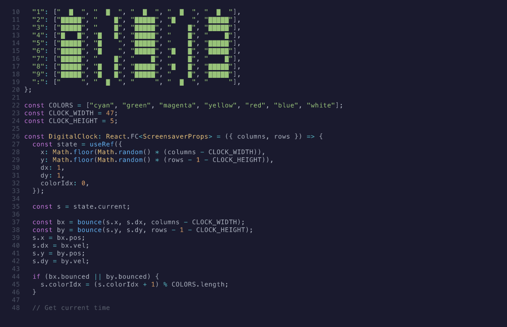 | Syntax-highlighted source code scrolling by like a Hollywood hacking scene |
| `starfield` |  | 3D stars flying toward the viewer |
| `tetris` | 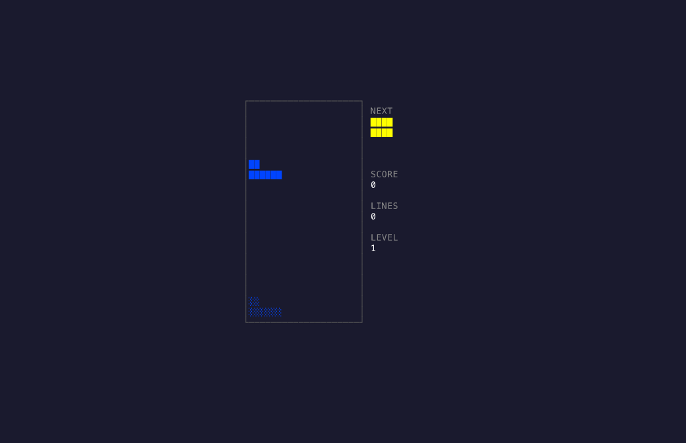 | Auto-playing Tetris with falling pieces, line clears, and scoring |
| `ticker-tape` | 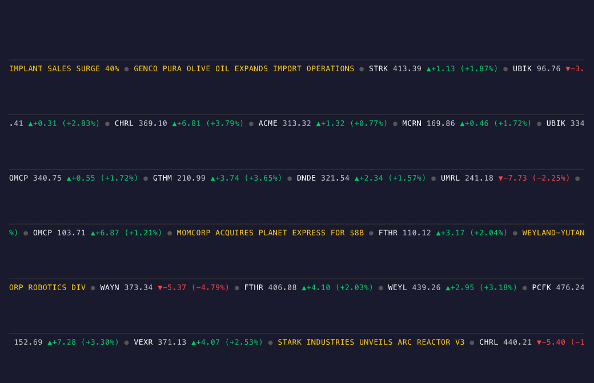 | Scrolling stock tickers and news headlines with color-coded prices |
| `tower-of-hanoi` |  | Animated Tower of Hanoi puzzle solution |
| `tunnel` |  | Spiraling tunnel vortex zooming toward the viewer |

## Usage

```bash
# Random screensaver
terminal-screensavers

# Specific screensaver
terminal-screensavers matrix-rain

# List all screensavers
terminal-screensavers --list

# Override FPS
terminal-screensavers starfield --fps 30
```

## Adding a Screensaver

1. Create `src/screensavers/<name>.tsx` exporting a `ScreensaverModule`:

```tsx
import type { ScreensaverModule, ScreensaverProps } from "../types.js";

function MyScreensaver({ columns, rows, frame, elapsed }: ScreensaverProps) {
  // render your screensaver
}

export const myScreensaver: ScreensaverModule = {
  name: "my-screensaver",
  description: "A short description",
  component: MyScreensaver,
  fps: 15,
};
```

2. Re-export from `src/screensavers/index.ts`
3. Add to the array in `src/registry.ts`

## Development

```bash
bun install
bun run dev              # run directly (no build step)
bun run dev matrix-rain  # run a specific screensaver
bun run build            # compile to dist/
bun run lint             # check with biome
bun run format           # auto-fix lint/format
```

## License

MIT
